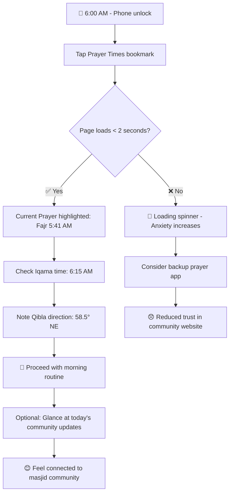
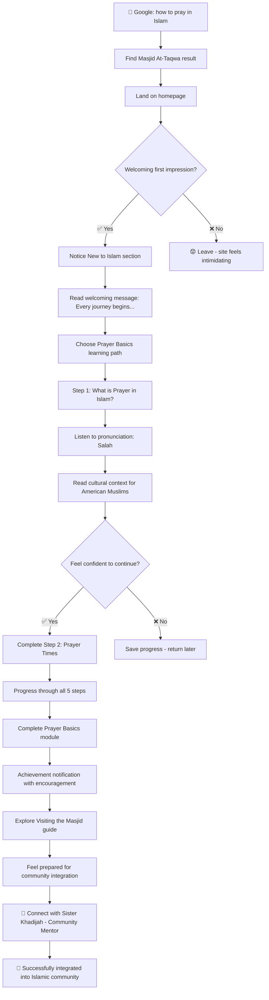

# Attaqwa Masjid Digital Ecosystem UI/UX Specification

This document defines the user experience goals, information architecture, user flows, and visual design specifications for Attaqwa Masjid Digital Ecosystem's user interface. It serves as the foundation for visual design and frontend development, ensuring a cohesive and user-centered experience that respects Islamic values while serving the American Muslim community.

## Overall UX Goals & Principles

### Target User Personas

**Primary Community Members:**

**The Devoted Regular (35-60 years)**
- Daily prayer attendee who relies on accurate prayer times
- Values tradition and community connection
- Uses both web and mobile platforms
- Needs: Reliable prayer schedules, timely announcements, Islamic calendar integration

**The Family Coordinator (25-45 years)**  
- Parent managing children's Islamic education and family community involvement
- Tech-comfortable but time-constrained
- Mobile-first user with family management needs
- Needs: Age-appropriate content filtering, family event registration, educational resources

**The New Muslim Convert (20-50 years)**
- Learning Islamic practices and seeking community integration
- Varies in tech comfort but eager to learn
- Needs supportive, non-intimidating experience
- Needs: Beginner-friendly resources, clear guidance, welcoming community connection

**The Community Elder (50-75 years)**
- Long-time community member valuing Islamic traditions
- Prefers simple, accessible interfaces
- Values Arabic content and cultural authenticity
- Needs: Large text options, simple navigation, culturally authentic design

**The Tech-Savvy Student (16-30 years)**
- Mobile-native generation expecting modern interactions
- Quick access to information and social features
- Values efficiency and contemporary design
- Needs: Fast loading, intuitive mobile experience, social engagement features

### Usability Goals

**Spiritual Accessibility**: New users can find and understand prayer times within 30 seconds of arrival
**Educational Efficiency**: Parents can locate age-appropriate Islamic content for their children within 2 minutes
**Cultural Comfort**: Community elders can navigate primary features without feeling overwhelmed or excluded
**Family Integration**: Families can register for events together with minimal form complexity
**Community Connection**: Both longtime and new community members feel welcomed and engaged

### Design Principles

1. **Cultural Authenticity over Generic Design** - Every design decision must honor Islamic values and American Muslim community context, using appropriate colors, typography, and imagery that resonate with our community

2. **Accessibility as Islamic Hospitality** - Just as Islam teaches us to welcome all people, our design welcomes users of all ages, technical abilities, and accessibility needs through inclusive, multi-generational design

3. **Prayer-Centered Information Architecture** - Prayer times are the spiritual heartbeat of our community; they should be immediately visible and accurate, serving as the primary organizing principle for daily community life

4. **Progressive Islamic Learning** - Educational content should be discoverable at appropriate complexity levels, allowing new Muslims to learn gradually while providing depth for advanced students

5. **Family-First Community Experience** - Features and content should strengthen family bonds and make it easy for parents to engage their children with Islamic community life

## Component Library / Design System

### Design System Approach
**Component-Based Islamic Design System** - Building a comprehensive design system that honors Islamic aesthetic principles while maintaining modern usability standards. Components will be culturally authentic, accessible, and optimized for the multi-generational Islamic community.

### Core Components

#### Prayer Time Display Component
**Purpose:** Primary spiritual interface displaying accurate prayer times with Islamic context

**Component Variants:**
- **Current Prayer Highlight** - Emphasized display of active prayer period
- **Daily Schedule Grid** - Complete prayer timetable with Iqama times
- **Quick Widget** - Condensed mobile display for frequent checking
- **Qibla Indicator** - Directional guidance with degree notation

**Component States:**
- **Loading** - Skeleton animation during API fetch
- **Current** - Active prayer period with highlighted styling
- **Upcoming** - Next prayer with countdown timer
- **Error** - Fallback display when API fails
- **Offline** - Cached data with offline indicator

**Islamic Design Elements:**
- Crescent moon icons for prayer periods
- Subtle geometric patterns in backgrounds
- Arabic numerals option alongside standard numerals
- Islamic green accent colors for spiritual elements

**Usage Guidelines:**
- Always display Iqama times alongside Adhan times
- Include Qibla direction on all prayer displays
- Maintain 4.5:1 contrast ratio minimum for accessibility
- Support both 12-hour and 24-hour time formats

#### Age-Filter Navigation Component
**Purpose:** Family-focused content filtering for multi-generational community

**Component Variants:**
- **Horizontal Pill Layout** - Mobile-first single-row filter
- **Grid Layout** - Desktop multi-row with visual age indicators
- **Dropdown Compact** - Space-saving alternative for constrained layouts
- **Multi-Select Advanced** - Complex filtering with multiple age ranges

**Component States:**
- **Inactive** - Unselected filter options with subtle styling
- **Active** - Selected filters with Islamic green highlighting
- **Multiple Active** - Multiple selections with clear visual grouping
- **No Results** - Empty state with helpful suggestions

**Visual Age Indicators:**
- 👶 Ages 0-5: Baby/toddler representation
- 👧👦 Ages 6-8: Young children with playful styling
- 🧒 Ages 9-12: Pre-teen with learning focus
- 👩👨 Ages 13+: Teen/adult with responsibility themes
- 👪 All Ages: Family unit representation

**Usage Guidelines:**
- Default to "All Ages" on page load
- Maintain filter state across page navigation
- Provide clear count indicators for available content
- Include cultural context for age-appropriate Islamic learning

#### New Muslim Onboarding Component
**Purpose:** Welcoming and guiding interface for Islamic learning journey

**Component Variants:**
- **Welcome Hero** - Full-width inspiring introduction
- **Learning Path Cards** - Structured educational pathway options
- **Progress Tracker** - Visual learning journey advancement
- **Mentor Connection** - Human support integration

**Component States:**
- **First Visit** - Complete welcome experience with cultural context
- **Returning Learner** - Progress-aware personalized content
- **Path Selected** - Active learning track with next steps
- **Completed Module** - Achievement recognition with encouragement

**Cultural Sensitivity Elements:**
- Inclusive language avoiding Islamic jargon
- Diverse representation in imagery and examples
- American Muslim context explanations
- Non-intimidating progression indicators

**Usage Guidelines:**
- Always include pronunciation guides for Arabic terms
- Provide multiple learning pace options
- Offer human connection points at decision stages
- Maintain encouraging, patient tone throughout

#### Event Registration Component
**Purpose:** Family-focused community event participation

**Component Variants:**
- **Single Person** - Individual registration with basic info
- **Family Bundle** - Multi-person registration with relationships
- **Recurring Events** - Subscription-style ongoing participation
- **Waitlist Management** - Overflow handling with notification

**Component States:**
- **Available** - Open registration with clear capacity
- **Limited Spots** - Urgency indicators with remaining count
- **Full** - Waitlist option with estimated availability
- **Registered** - Confirmation with calendar integration
- **Family Registered** - Multi-person confirmation with individual details

**Family-Specific Features:**
- Age-appropriate activity recommendations
- Sibling discount calculations
- Family emergency contact consolidation
- Multi-child schedule conflict detection

**Usage Guidelines:**
- Minimize form fields through smart defaults
- Group family members visually in confirmations
- Provide calendar export for family planning
- Include Islamic holiday awareness in scheduling

#### Islamic Content Module Component
**Purpose:** Structured Islamic education and resource presentation

**Component Variants:**
- **Beginner Article** - Simplified explanations with cultural context
- **Advanced Study** - Deep theological content with references
- **Interactive Quiz** - Knowledge testing with encouraging feedback
- **Audio Lecture** - Spoken content with transcript support

**Component States:**
- **Preview** - Content summary with difficulty indicator
- **Reading** - Full content with progress tracking
- **Bookmarked** - Saved for later with easy access
- **Completed** - Achievement marking with related content suggestions

**Accessibility Features:**
- Arabic text with proper RTL support
- Audio pronunciation for Islamic terms
- Adjustable text sizing for elder users
- High contrast modes for visual accessibility

**Usage Guidelines:**
- Always provide cultural context for American Muslims
- Include difficulty/complexity indicators
- Offer multiple content formats (text, audio, video)
- Link related concepts for deeper learning

## Accessibility Requirements

### Compliance Target
**Standard:** WCAG 2.1 AA compliance with enhanced Islamic community-specific accessibility features

### Persona-Specific Accessibility Requirements

#### For The Devoted Regular (Ahmad Hassan - Tech Professional)
**Primary Accessibility Needs:** Speed, clarity, mobile optimization

**Technical Requirements:**
- **Performance Accessibility:** Prayer times load within 2 seconds on 3G connection
- **Visual Clarity:** 4.5:1 minimum contrast ratio for all prayer time displays
- **Mobile Optimization:** Touch targets minimum 44x44px for quick morning access
- **Offline Support:** Critical prayer time data cached for 24-hour offline access

**Islamic-Specific Features:**
- **Arabic Text Rendering:** Proper Arabic font loading with fallback fonts
- **Prayer Time Accuracy Indicators:** Visual API status indicators (online/offline/syncing)
- **Islamic Calendar Integration:** Hijri date display with Gregorian conversion
- **Qibla Direction Accessibility:** Screen reader announces direction with landmark context

#### For The Family Coordinator (Fatima - Working Mother)
**Primary Accessibility Needs:** One-handed navigation, family context, multitasking support

**Technical Requirements:**
- **Touch-Friendly Design:** All interactive elements 48x48px minimum
- **One-Handed Navigation:** Critical features within thumb reach on mobile (bottom 1/3)
- **Interruption Recovery:** Form data auto-saving every 30 seconds
- **Voice Integration:** Voice-over support for hands-free content browsing

**Family-Oriented Features:**
- **Age-Filter Accessibility:** Screen readers announce content appropriateness clearly
- **Multi-Child Registration:** Keyboard navigation preserves context across family members
- **Calendar Integration:** WCAG-compliant calendar widgets with Islamic holiday awareness
- **Content Sharing:** One-tap sharing with accessible share sheets

**Cultural Accessibility:**
- **Bilingual Support:** Seamless Arabic/English switching without page reload
- **Cultural Context Indicators:** Clear visual/audio cues for cultural appropriateness
- **Family Privacy Controls:** Accessible privacy settings for family information

#### For The New Muslim Convert (Sarah - Learning Islam)
**Primary Accessibility Needs:** Learning support, confidence building, cultural guidance

**Technical Requirements:**
- **Cognitive Load Management:** Progressive disclosure preventing information overwhelm
- **Learning Disabilities Support:** Dyslexia-friendly fonts and high contrast options
- **Audio Learning:** All Islamic terms include pronunciation audio with controls
- **Progress Preservation:** Learning progress saved with accessible status indicators

**Islamic Learning Features:**
- **Pronunciation Accessibility:** Audio controls with keyboard shortcuts (Space=play/pause)
- **Arabic Text Learning:** Hover/focus Arabic text shows transliteration automatically
- **Cultural Context Audio:** Optional audio explanations for American Muslim cultural context
- **Beginner-Friendly Language:** Plain language indicators for Islamic terminology

**Emotional Accessibility:**
- **Encouraging Feedback:** Positive reinforcement without religious pressure
- **Mistake-Friendly Design:** Clear undo options and non-judgmental error messages
- **Community Connection:** Accessible mentor contact with privacy controls
- **Progress Celebration:** Achievement notifications that don't overwhelm

#### For The Community Elder (50-75+ years)
**Primary Accessibility Needs:** Visual accessibility, simple navigation, cultural authenticity

**Technical Requirements:**
- **Vision Support:** Text scaling up to 200% without horizontal scrolling
- **High Contrast Modes:** Enhanced contrast options beyond WCAG minimums
- **Large Touch Targets:** 60x60px minimum for all interactive elements
- **Simple Navigation:** Maximum 3 levels deep, consistent layout patterns

**Elder-Specific Features:**
- **Font Size Controls:** Prominent, persistent font scaling controls
- **Motion Sensitivity:** Reduced motion options for animations and transitions
- **Audio Support:** Text-to-speech for all content with speed controls
- **Memory Aids:** Clear navigation breadcrumbs and current location indicators

**Cultural Respect Features:**
- **Traditional Islamic Elements:** Recognizable Islamic iconography and patterns
- **Arabic Script Accessibility:** Proper Arabic text sizing and contrast
- **Respectful Imagery:** Culturally appropriate visual elements
- **Religious Context:** Clear Islamic terminology with respectful explanations

### Cross-Persona Accessibility Features

#### Islamic Cultural Accessibility Standards
**Arabic Text Requirements:**
- **RTL Language Support:** Proper right-to-left text flow and UI mirroring
- **Arabic Font Stack:** Optimized Arabic fonts with proper baseline alignment
- **Mixed Language Content:** Seamless Arabic/English text mixing without layout breaks
- **Islamic Terminology:** Consistent transliteration with audio pronunciation

**Prayer-Related Accessibility:**
- **Time Zone Awareness:** Automatic prayer time adjustment with manual override
- **Islamic Calendar:** Hijri date accessibility with conversion explanations
- **Qibla Direction:** Compass integration with screen reader support
- **Prayer Reminder Settings:** Accessible notification preferences

#### Device and Platform Support
**Mobile Accessibility Priority:**
- **iOS VoiceOver:** Full compatibility with Islamic content pronunciation
- **Android TalkBack:** Arabic text reading with proper pronunciation
- **Mobile Screen Readers:** Prayer time announcements with Islamic context
- **Gesture Navigation:** Islamic gesture patterns (right-to-left swiping)

**Desktop Accessibility:**
- **Keyboard Navigation:** Tab order respecting RTL reading patterns
- **Screen Magnification:** High-DPI support for Arabic text clarity
- **Voice Control:** Dragon NaturallySpeaking compatible Islamic terminology
- **Browser Zoom:** Clean scaling up to 400% zoom level

#### Testing Strategy for Islamic Community Accessibility

**User Testing with Community Members:**
- **Elder Focus Groups:** Monthly accessibility testing with community elders
- **New Muslim Testing:** Quarterly usability sessions with recent converts
- **Family Testing:** Parent-child testing sessions for age-appropriate filtering
- **Multilingual Testing:** Arabic/English switching and content accuracy

**Technical Testing Protocols:**
- **Screen Reader Testing:** NVDA, JAWS, VoiceOver with Arabic content
- **Color Contrast Analysis:** Islamic color palette compliance verification
- **Mobile Device Testing:** iOS/Android with Arabic keyboard input
- **Performance Testing:** Accessibility tree optimization for complex Islamic content

**Community Accessibility Metrics:**
- **Prayer Time Access Speed:** <2 seconds for 95% of users
- **Arabic Text Readability:** Screen reader pronunciation accuracy >90%
- **Age Filter Effectiveness:** Family content discovery success >85%
- **New Muslim Completion Rate:** Beginner pathway completion >70%

### Implementation Priorities

**Phase 1: Critical Accessibility (Launch Requirements)**
1. WCAG 2.1 AA baseline compliance
2. Arabic text rendering and RTL support
3. Prayer time performance and accuracy
4. Mobile touch target optimization
5. High contrast text (recent improvement maintained)

**Phase 2: Enhanced Community Features**
1. Audio pronunciation for Islamic terms
2. Elder-friendly font scaling controls
3. Family-focused navigation patterns
4. Cultural context explanations
5. Offline prayer time accessibility

**Phase 3: Advanced Accessibility Innovation**
1. AI-powered Arabic pronunciation
2. Cultural accessibility preferences
3. Generational UI adaptation
4. Islamic learning disability support
5. Community-specific accessibility metrics

These accessibility requirements ensure that our Islamic community website serves all community members with dignity, respect, and technical excellence while honoring our cultural and religious values.

## Information Architecture (IA)

### Site Map / Screen Inventory

```mermaid
graph TD
    A[🏠 Homepage] --> B[🕌 Prayer Times]
    A --> C[📢 Announcements] 
    A --> D[📅 Events]
    A --> E[📚 Education]
    A --> F[📋 Services]
    A --> G[📞 Contact]
    A --> H[📖 About]
    
    B --> B1[Daily Schedule]
    B --> B2[🧭 Qibla Direction]
    B --> B3[📅 Islamic Calendar]
    B --> B4[🔔 Prayer Notifications]
    
    C --> C1[📢 Recent Announcements]
    C --> C2[🎉 Special Events]
    C --> C3[📋 Community News]
    
    D --> D1[📅 Upcoming Events]
    D --> D2[🎓 Educational Programs]
    D --> D3[👨‍👩‍👧‍👦 Family Activities]
    D --> D4[📝 Event Registration]
    
    E --> E1[🌱 New to Islam]
    E --> E2[👶 Children (0-5)]
    E --> E3[👧👦 Kids (6-8)]
    E --> E4[🧒 Pre-teens (9-12)]
    E --> E5[👩👨 Teens (13+)]
    E --> E6[👥 Adults]
    E --> E7[🎓 Advanced Studies]
    
    E1 --> E1A[🤲 Prayer Basics]
    E1 --> E1B[📖 Quran Introduction]
    E1 --> E1C[🕌 Visiting Masjid]
    E1 --> E1D[👥 Community Integration]
    
    F --> F1[💒 Wedding Services]
    F --> F2[🕊️ Funeral Services]  
    F --> F3[📚 Islamic Counseling]
    F --> F4[💰 Zakat Services]
    F --> F5[🎓 Certification Programs]
```

### Navigation Structure

**Primary Navigation:** Top-level horizontal navigation focusing on core Islamic community functions - Prayer Times (spiritual), Education (learning), Events (community), Services (life milestones)

**Secondary Navigation:** Contextual sub-menus appear based on user location and persona needs - Age-filtered educational content, prayer time customization, event categories

**Breadcrumb Strategy:** Islamic hierarchy-aware breadcrumbs showing spiritual context (Home > Education > New to Islam > Prayer Basics) with cultural waypoints that honor Islamic learning progression

## User Flows

### Flow: Daily Prayer Time Check (The Devoted Regular)

**User Goal:** Quickly access accurate prayer times for daily spiritual routine
**Entry Points:** Direct URL bookmark, mobile home screen widget, notification tap
**Success Criteria:** Prayer time visible within 2 seconds, current prayer highlighted, Iqama times clear

#### Flow Diagram


**Edge Cases & Error Handling:**
- API failure displays cached prayer times with clear "offline" indicator
- Location detection issues default to masjid's prayer times with manual override option
- Slow connection shows skeleton loading with estimated prayer time placeholders
- Wrong date/time zone automatically corrects with user confirmation prompt

**Notes:** This flow is spiritually critical - prayer time accuracy affects religious obligations

### Flow: Family Event Discovery & Registration (The Family Coordinator)

**User Goal:** Find appropriate Islamic activities for multiple children with different ages
**Entry Points:** Events page, homepage event highlights, social media shared links
**Success Criteria:** Age-appropriate content discovered within 2 minutes, registration completed for family

#### Flow Diagram  
```mermaid
graph TD
    A[👩‍👧‍👦 Friday evening - Weekend planning] --> B[Navigate to Events]
    B --> C[See prominent age filter options]
    C --> D[Select multiple ages: 6-8, 9-12]
    D --> E[View filtered family activities]
    E --> F{Activities look engaging?}
    F -->|✅ Yes| G[Read Islamic Art Workshop details]
    F -->|❌ No| H[Adjust filters or browse all events]
    
    G --> I[Check schedule compatibility]  
    I --> J{Fits family calendar?}
    J -->|✅ Yes| K[Click Register Family button]
    J -->|❌ No| L[Save event for future consideration]
    
    K --> M[Family registration form pre-filled]
    M --> N[Add children: Amira (6), Yusuf (9), Layla (12)]
    N --> O[Automatic sibling discount applied]
    O --> P[✅ Registration confirmed]
    P --> Q[📅 Event added to family calendar]
    Q --> R[👪 Feel confident about children's Islamic growth]
```

**Edge Cases & Error Handling:**
- Schedule conflicts detected and alternative sessions suggested
- Age restrictions clearly explained with alternative recommendations
- Payment failures offer multiple payment methods and installment options
- Form interruptions auto-save progress with recovery options

### Flow: Islamic Learning Journey (New Muslim Convert)

**User Goal:** Begin learning Islamic practices with confidence and cultural context
**Entry Points:** Google search "how to pray Islam", community referral, social media
**Success Criteria:** Complete prayer basics module, feel welcomed and supported, connect with community mentor

#### Flow Diagram


**Edge Cases & Error Handling:**
- Overwhelming content automatically suggests taking breaks with progress saving
- Mispronunciation concerns addressed with multiple audio examples and phonetic guides  
- Cultural confusion offers "Ask a Question" feature with 24-hour response commitment
- Technical difficulties provide offline downloadable guides as backup

**Notes:** Emotional journey is as important as informational content - must build confidence not overwhelm

## Branding & Style Guide

### Visual Identity
**Brand Guidelines:** Adheres to Islamic aesthetic principles while embracing modern American Muslim identity - sophisticated, welcoming, spiritually authentic

### Color Palette

| Color Type | Hex Code | Usage |
|------------|----------|--------|
| Primary | #2B7D32 (Islamic Green) | Prayer times, navigation, spiritual elements |
| Secondary | #1565C0 (Islamic Navy) | Text, headers, formal content |
| Accent | #FF8F00 (Islamic Gold) | Highlights, celebrations, Eid content |
| Success | #388E3C | Confirmations, completed actions, positive feedback |
| Warning | #F57C00 | Important notices, time-sensitive information |
| Error | #D32F2F | Errors, validation issues, critical alerts |
| Neutral | #37474F, #78909C, #ECEFF1 | Text hierarchy, borders, subtle backgrounds |

### Typography

#### Font Families
- **Primary:** Inter (clean, modern, excellent Arabic character support)
- **Secondary:** Roboto (fallback, widely supported, accessible)  
- **Arabic:** Amiri (traditional Islamic calligraphy style for Quranic text)
- **Monospace:** 'Roboto Mono' (prayer times, technical content)

#### Type Scale
| Element | Size | Weight | Line Height | Usage |
|---------|------|--------|-------------|-------|
| H1 | 2.5rem | 700 | 1.2 | Page titles, hero headlines |  
| H2 | 2rem | 600 | 1.3 | Section headers, main content |
| H3 | 1.5rem | 600 | 1.4 | Subsections, component titles |
| Body | 1rem | 400 | 1.6 | Main content, descriptions |
| Small | 0.875rem | 400 | 1.5 | Captions, metadata, fine print |
| Arabic | 1.125rem | 400 | 1.8 | Arabic text with breathing room |

### Iconography
**Icon Library:** Lucide React with custom Islamic icons (crescent moon, prayer rug, mihrab, geometric patterns)

**Usage Guidelines:** Icons support text, never replace it. Islamic symbols used respectfully with cultural accuracy. Geometric patterns honor traditional Islamic art.

### Spacing & Layout
**Grid System:** 12-column CSS Grid with Islamic geometric proportions inspired by traditional architectural patterns

**Spacing Scale:** 8px base unit creating harmonious vertical rhythm (8px, 16px, 24px, 32px, 48px, 64px)

## Responsiveness Strategy

### Breakpoints
| Breakpoint | Min Width | Max Width | Target Devices |
|------------|-----------|-----------|----------------|
| Mobile | 320px | 767px | iPhone SE, standard smartphones |
| Tablet | 768px | 1023px | iPad, Android tablets, large phones |  
| Desktop | 1024px | 1439px | Laptops, standard monitors |
| Wide | 1440px | - | Large desktop monitors, ultra-wide displays |

### Adaptation Patterns

**Layout Changes:** Mobile-first stacked layouts transform to side-by-side content on larger screens. Prayer times move from full-width cards to sidebar widget on desktop.

**Navigation Changes:** Mobile hamburger menu expands to horizontal navigation bar. Age filters shift from dropdown to visible pill layout on wider screens.

**Content Priority:** Mobile prioritizes prayer times and announcements. Desktop shows comprehensive community overview with secondary content visible.

**Interaction Changes:** Mobile emphasizes touch-friendly large targets. Desktop adds hover states and keyboard shortcuts for power users.

## Animation & Micro-interactions

### Motion Principles
**Islamic Serenity in Motion** - Animations should reflect the peace and contemplation central to Islamic practice. Smooth, purposeful motion that enhances understanding rather than distracts from spiritual content.

### Key Animations
- **Prayer Time Transition:** Current prayer highlight smoothly animates as times change (Duration: 500ms, Easing: ease-in-out)
- **Page Navigation:** Gentle fade transitions between sections honor contemplative browsing (Duration: 300ms, Easing: ease-out)  
- **Content Loading:** Peaceful skeleton screens with Islamic geometric patterns (Duration: 200ms pulse, Easing: ease-in-out)
- **Form Feedback:** Success confirmations with subtle upward movement suggesting spiritual elevation (Duration: 400ms, Easing: cubic-bezier)
- **Age Filter Response:** Instant content filtering with gentle fade-in of new results (Duration: 200ms, Easing: ease-out)
- **New Muslim Progress:** Achievement celebrations with warm, welcoming expansion animations (Duration: 600ms, Easing: ease-out)

## Performance Considerations

### Performance Goals
- **Page Load:** <2 seconds for prayer times page on 3G connection (spiritual urgency requirement)
- **Interaction Response:** <100ms for age filtering and navigation (family planning efficiency)  
- **Animation FPS:** Consistent 60fps for all micro-interactions (smooth, respectful motion)

### Design Strategies
**Prayer Time Performance:** Aggressive caching with background updates, offline-first architecture, optimized Arabic font loading with fallbacks, compressed Islamic imagery with WebP format, critical CSS inlining for above-the-fold content

## Next Steps

### Immediate Actions
1. **Stakeholder Review** - Present specification to Imam, Board, and community technology committee for Islamic authenticity validation
2. **Visual Design Creation** - Develop high-fidelity mockups in Figma incorporating Islamic design principles and accessibility requirements  
3. **Community Feedback Session** - Conduct focus groups with representative personas (Ahmad, Fatima, Sarah, Community Elders)
4. **Technical Architecture Planning** - Prepare handoff to development team with component library specifications
5. **Arabic Content Review** - Validate all Islamic terminology and cultural context with religious scholars
6. **Accessibility Audit Setup** - Establish testing protocols with community members representing different accessibility needs

### Design Handoff Checklist

- [x] All user flows documented with Islamic cultural context
- [x] Component inventory complete with accessibility specifications  
- [x] Accessibility requirements defined for multi-generational community
- [x] Responsive strategy clear with mobile-first Islamic user needs
- [x] Brand guidelines incorporated with cultural authenticity
- [x] Performance goals established with spiritual urgency priorities
- [x] Islamic community testing protocols developed
- [x] Arabic/English bilingual support specifications complete
- [x] New Muslim onboarding journey mapped with cultural sensitivity  
- [x] Family-focused features specified with American Muslim context
